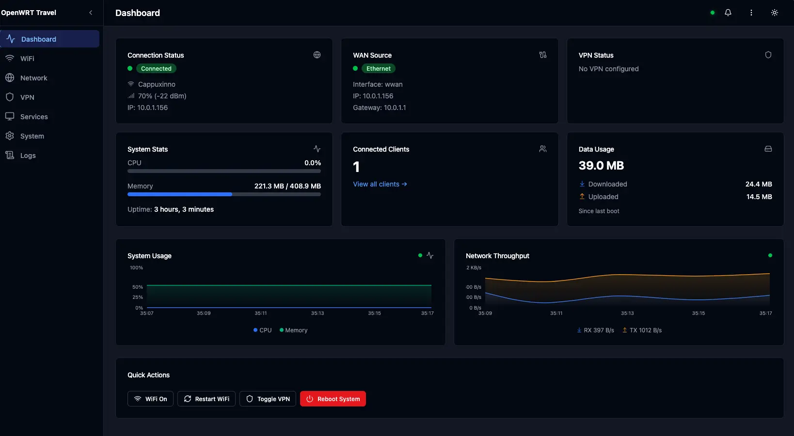

# Travo

<p align="center">
  
</p>

A modern, mobile-first web UI for OpenWRT-based travel routers (GL.iNet Beryl AX MT3000, Slate AXT1800).

Provides an intuitive dashboard, WiFi management with hotel captive portal support, VPN/service management, and system configuration. Built as a Go backend + React frontend monorepo that coexists with LuCI.



## Documentation

- Contributor and agent doc map: [docs/README.md](docs/README.md)
- Stable architecture decisions: [docs/architecture.md](docs/architecture.md)
- Active backlog: [docs/requirements/tasks_open.md](docs/requirements/tasks_open.md)

## Quick Install

SSH into your OpenWRT router and run:

```sh
wget -O- https://raw.githubusercontent.com/raydak-labs/travo/main/scripts/install.sh | sh
```

This installs Travo on port 80, AdGuard Home on port 3000 (DNS on 5353 via dnsmasq forwarding),
and moves LuCI to port 8080. See [docs/deployment.md](docs/deployment.md) for
all options and manual install instructions.

> **Default AdGuard credentials:** `admin` / `password` — change immediately via
> **Settings → AdGuard Password** in the Travo UI.

## General

- UI / UX inspired by GL.iNet ([review article](https://medium.com/aimonks/gl-inet-slate-7-travel-router-a-review-920bddcea4ca))

## Architecture

```
┌─────────────────────────────────────────────┐
│              Browser (React SPA)            │
│  TanStack Query/Router, Shadcn/UI, Zustand  │
└──────────────────┬──────────────────────────┘
                   │ REST + WebSocket
┌──────────────────▼──────────────────────────┐
│           Go Backend (Fiber)                │
│  ┌─────────┐ ┌──────────┐ ┌──────────────┐ │
│  │ Auth    │ │ REST API │ │ WebSocket    │ │
│  │ (session│ │ handlers │ │ (live stats) │ │
│  │  +JWT)  │ │          │ │              │ │
│  └────┬────┘ └────┬─────┘ └──────┬───────┘ │
│       │           │               │         │
│  ┌────▼───────────▼───────────────▼───────┐ │
│  │        Service Layer                   │ │
│  │  UCI wrapper │ ubus client │ opkg mgr  │ │
│  └────────────────────────────────────────┘ │
│       │ (mock mode: in-memory fakes)        │
└───────┼─────────────────────────────────────┘
        │ exec / socket
┌───────▼─────────────────────────────────────┐
│            OpenWRT System                   │
│  UCI configs │ ubus │ init.d │ iwinfo      │
└─────────────────────────────────────────────┘
```

## Features

- **Dashboard** — Real-time system stats, connection status, quick actions
- **WiFi Management** — Scan, connect, mode switching (client/repeater/AP)
- **Hotel Captive Portal** — Automatic detection and one-click login
- **VPN Management** — WireGuard and Tailscale configuration
- **Service Management** — Install/manage AdGuard Home and other services
- **System Settings** — Network, DNS, firewall configuration
- **Mobile-First** — Responsive design optimized for phone access
- **Dark/Light Theme** — System preference detection with manual toggle
- **LuCI Coexistence** — Runs on port 80/443, LuCI relocated to 8080

## Quickstart

### Prerequisites

- [Node.js](https://nodejs.org/) >= 20
- [pnpm](https://pnpm.io/) >= 9
- [Go](https://go.dev/) >= 1.23

### Setup

```bash
# Clone the repository
git clone https://github.com/raydak-labs/travo.git
cd travo

# Install Node dependencies (also generates MSW mock worker for dev mode)
pnpm install

# Install Go dependencies
cd backend && go mod tidy && cd ..

# Run development servers
make dev
```

> **Troubleshooting:** If the frontend shows a white page, the MSW service worker may be
> missing. Run `cd frontend && pnpm exec msw init public --save` to regenerate it.

### Commands

| Command            | Description                            |
| ------------------ | -------------------------------------- |
| `make dev`         | Run frontend + backend dev servers     |
| `make build`       | Build frontend and backend             |
| `make test`        | Run all tests (Go + shared + frontend) |
| `make lint`        | Run ESLint + go vet                    |
| `make format`      | Run Prettier + gofmt                   |
| `make clean`       | Remove build artifacts                 |
| `make build-prod`  | Cross-compile for OpenWRT (aarch64)    |
| `make build-all`   | Cross-compile for aarch64 and x86_64   |
| `make package`     | Create .ipk package                    |
| `make package-all` | Create .ipk for aarch64 and x86_64     |
| `make deploy`      | Deploy to router (needs `ROUTER_IP`)   |
| `make docker-dev`  | Start Docker dev environment           |

## Docker Development

```bash
docker compose up
```

Runs frontend (Vite + HMR) and backend (Air hot reload) in containers. Same ports: frontend on :5173, backend on :3000.

## Building for OpenWRT

```bash
# Cross-compile binary for aarch64
make build-prod

# Create .ipk package
make package
```

See [docs/deployment.md](docs/deployment.md) for full details.

## Deployment

```bash
# Deploy to router
make deploy ROUTER_IP=192.168.8.1
```

This installs the `.ipk`, moves LuCI to port 8080, and starts the travel GUI on port 80. See [docs/deployment.md](docs/deployment.md).

## Project Structure

```
travo/
├── frontend/          # React + TypeScript + Vite + TailwindCSS
│   ├── src/
│   │   ├── components/  # UI components
│   │   ├── pages/       # Page components
│   │   ├── lib/         # Utilities, API client
│   │   └── main.tsx     # Entry point
│   ├── index.html
│   └── vite.config.ts
├── backend/           # Go + Fiber
│   ├── cmd/server/    # Main server entry
│   └── internal/      # Internal packages
├── shared/            # Shared TypeScript types
│   └── src/
├── scripts/           # Dev and build scripts
├── docs/plans/        # Project planning documents
├── Makefile
└── package.json       # Workspace root
```

## Target Devices

- **GL.iNet Beryl AX (MT3000)** — aarch64
- **GL.iNet Slate AXT1800** — aarch64
- Any OpenWRT 23.05+ device (aarch64 or x86_64)

## Releases

Pre-built binaries and `.ipk` packages for aarch64 and x86_64 are available on
[GitHub Releases](https://github.com/raydak-labs/travo/releases).

To create a new release, tag and push:

```bash
git tag v1.0.0
git push origin v1.0.0
```

The CI/CD pipeline automatically builds all artifacts and publishes a GitHub Release.

## Contributing

See [CONTRIBUTING.md](CONTRIBUTING.md) for guidelines.

## License

[MIT](LICENSE) — Copyright 2026 openwrt-travel-gui contributors
